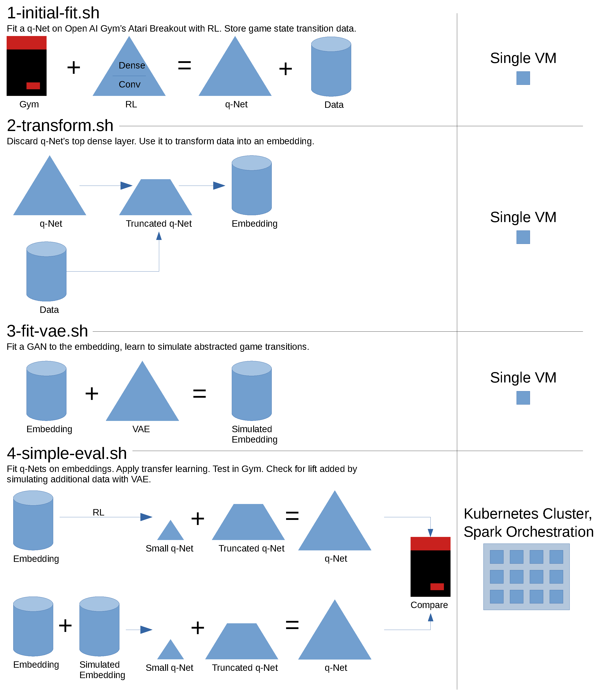

# rl-hypothesis-1

This is an attempt at artificial general intelligence (AGI), defining AGI to be capable of arbitrary problem solving even if not particularly intelligent. To date, the closest solution is reinforcement learning (RL). RL is great at solving simulatable games, so is now used to solve video games. However, a true automaton should not be constrained to video games. To an RL agent, the only difference between reality and video games is the amount of data--there is far less data in the real world. Fortunately, the recent development of generative adversarial nets (GANs) may be able to bridge this gap. GANs are able to learn how to simulate. So, the fundamental question is: **can GANs pad AGI agents' data sets sufficiently to achieve functional RL?** This repo test this question. 

One major caveat is that GANs aren't powerful enough to simulate totally-accurate game transitions (RL data). To get around this, I'm applying transfer learning. The transfer learning transform is summarized in this [notebook](https://github.com/wdurno/rl-hypothesis-1/blob/master/v1.0.0/designing-simulation-routine.ipynb). The majority of my q-Net (RL deep net) is trained on a very large RL dataset. Only the upper-most dense net will be fit on GAN-simulated data. Simulation quality is analyzed in this [notebook](https://github.com/wdurno/rl-hypothesis-1/blob/v1.0.0/notebooks/cgan-analysis.ipynb). This enables the GAN to simulate an embedding instead of exact game states. This should also abstract-away visual processing information, leaving distilled strategic information. Transfer learning will gives GANs a chance to succeed. I feel this concession is acceptable because a similar design choice has effectively been applied in biological evolution--even humans' preceptive mechanisms are largely based in our animal origins.

This experiment's engineering has been fascinating, involving non-trivial scaling challenges. PySpark manages work communication and execution, but only executes workers' Python as child processes. This enables workers' Python to be arbitrarily complex, not constrained to PySpark's definitions nor the JVM, and is necessary for RL and GAN software. PySpark is executed in containers orchestrated by Kubernetes. Containers' builds abstract-away RL and GAN complexity, exposing a simple Python interface to PySpark.

The hypothesis is tested by executing an RL experiment with variably padded data, playing `Breakout`. If GAN-padding can increase the average score, we are one important step closer to releasing AGI into the real world. Latest experimental results are summarized [here](https://github.com/wdurno/rl-hypothesis-1/blob/v1.0.0/notebooks/metric-summary.ipynb).

## Resources 

Fast and easy experimentation is prioritized. Content will be copied from public repos to avoid manual programming when possible. 
- base q-net software [here](https://github.com/rlcode/reinforcement-learning/blob/master/3-atari/1-breakout/breakout_dqn.py) 
- execution environment [here](https://github.com/jaimeps/docker-rl-gym#docker-hub) 
  - NVidia TOS denies distribution of `cudnn` lib, so environment is CPU-only. This isn't a big setback since game simulation eats most of the time and is largely CPU-driven.
- c-gan [here](https://github.com/eriklindernoren/Keras-GAN/blob/master/cgan/cgan.py) 
  - Given the abstract nature of my data, I'm avoiding simulation of non-continuous values. 
  - I simulate discrete values from their empirical distribution.  

I've tested the q-net and gan software. It's good stuff. The q-net really needs some heavy parallelization, ideally a parameter server. However, I don't have the dev time and will eat the cycles instead. Fortunately, it seems to be using available CPU cores (up to 14) and does seem to need a lot of RAM--so, I'll use a beefy node.  

## Build 

- Build environment: GCP console. 
- Configure with `config.sh` 
  - Service account required.  
- Execute build with `bash build.sh` 

## Execution 

- Fit initial model 
  - Run `bash 1-initial-fit.sh`
- Run transfer learning transform 
  - Run `bash 2-transform.sh`
- Fit GAN 
  - Run `bash 3-fit-gan.sh`
- Simple evaluation 
  - Run `bash 4-scaled-simple-eval.sh`
  - Launches Spark on Kubernetes cluster 
  - Generates samples from GAN
  - Fits a transfer-learned q-net 
  - Returns game play performance statistics

## How it works 

### Engineering details 

- Compute environment is a single, multi-purpose container. 
- VMs and Clusters will auto-terminate after executing work. 
- Spark worker nodes are assigned to preemptible machines, reducing compute costs by about 5 times.

## Results 

Data suggests a weak negative result. GAN-padding isn't providing statistically significant lift. Fortunately, the hypothesis isn't necessarily voided. Sample sizes have been low so far, so increasing sample sizes could illustrate small, yet-positive effect sizes. Also, not enough time has been put into designing a high-quality generative process. There's still plenty of room for a positive result here.

